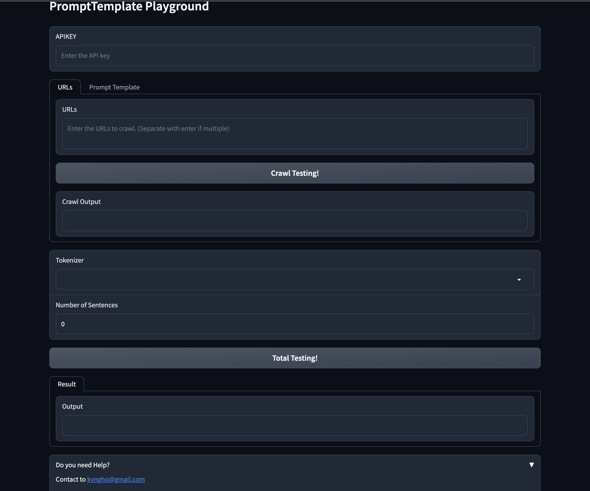

# Prompt template playground with [Gradio](https://gradio.app)
[](https://www.python.org/downloads/release/python-3100/)
[](https://gradio.app)



## QuickStart (Using Docker)

0. Clone this repo
   ```shell
   git clone https://github.com/kvngho/prompt-template-playground.git
   cd prompt-template-playground/
   ```
1. [Install Docker](https://docker.io)
2. Build the docker image
    ```shell
    docker build -t playground .
    ```
3. Run docker compose
    ```shell
    docker compose up -d
    ```
4. You can see playground in http://localhost:7861
